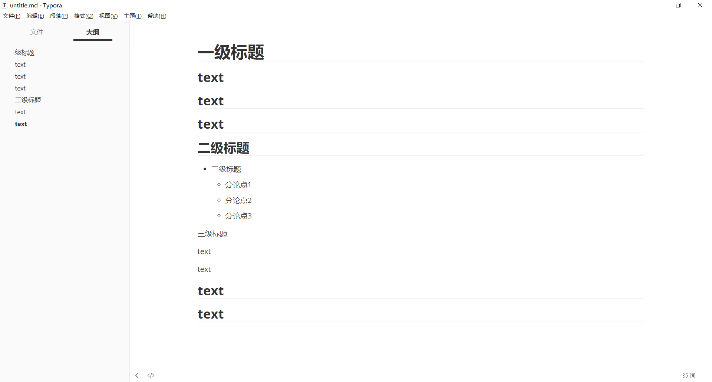

# Java MDmap-MyMind 说明文档

## 小组信息：

### 成员1：

​	**姓名**：李阳

​	**学号**：20373765

​	**项目中的职责**：完成思维导图的导入功能，导出为md格式和Xmind格式功能，以及节点自动排版功能，边界检测和溢出矫正功能。

### 成员2：

​	**姓名**：洪秋訸

​	**学号**：20373721

​	**项目中的职责**：完成思维导图的GUI设计，以及思维导图导出为图片的功能。

### 成员3：

​	**姓名**：徐亦佳

​	**学号**：20373661

​	**项目中的职责**：完成思维导图的基本功能，添加，删除，移动，编辑节点，以及节点显示的主题设计

## 编写项目的目的

​	本项目旨在完成一个功能较为齐全的简易思维导图软件，能够拥有思维导图的基本添加节点，移动，删除功能，并且在这个基础上添加了导入md格式的文本自动转化为思维导图，思维导图可导出为md格式，Xmind格式，jpg格式的功能。

## 项目运行环境

### 	**硬件种类：**

​					无特殊硬件要求

### 	**JDK版本：**

​					JDK 1.8

### 	**操作系统：**

​					windows 64 位操作系统 ，mac os 均支持

### 类的设计

​		


## 用户使用说明

### 	主界面

​		主界面设置了上方的功能按钮区以及中间画布区两个区域，初始界面如图所示。


### 	基本功能说明

​		

左上方按钮区域中设置了几个基本功能，包括节点的添加，删除，编辑，清空画布。

**添加功能：**点击某一个节点，然后点击左上方功能区添加按钮，将会添加该节点的子节点。

**删除功能：**设置了两种删除方式，一种是点击某一个节点，然后点击左上方功能区删除按钮，将会删除该节点及其子节点。另一种是双击左键某一节点，将会删除该节点及其子节点。

**编辑功能：**设置了两种编辑方式，一种是点击某一个节点，然后点击左上方功能区编辑按钮，另一种是双击右键某一节点，这两种方式均会弹出编辑窗口。


**打开功能：**

支持md格式和xmind格式打开功能，并且支持自动排版。

**导出功能：**

支持导出为md格式，xmind格式以及导出为图片格式。

**导出md格式效果图：**



**导出图片格式效果图：**设置了边界截图自适应


### UI设计说明

​	**交互设计**：我们设计了三种节点样式，点击某一个节点会有显示边框提示选中的节点，并且在挪动到节点上会有节点变色效果提示。

​	**排版设计**：自动导入和手动添加节点的两种情况，我们均设计了自动排版功能，以求比较美观的界面。

## API

```c
import org.xmind.core.Core;
import org.xmind.core.CoreException;
import org.xmind.core.ISheet;
import org.xmind.core.ITopic;
import org.xmind.core.IWorkbook;
import org.xmind.core.IWorkbookBuilder;
```

引入xmind思维导图的API，实现xmind文件格式的打开和保存。

## 算法说明

#### 	移动节点左右镜像功能

​			节点进行左右镜像的时候会通过定位节点在根节点的左右进行判断，然后如果节点需要镜像的话会使用递归将所有的子节点和连线进行镜像。

```java
public void updateConnect(ThemeLabel themeLabel, int deltax, int deltay) {

    /*****遍历树更新主题后所有连接关系*********/
    this.updateConnectHelper(themeLabel, deltax, deltay, true);
    if (themeLabel.getallChild().size() > 0) {
        ConnectLine connectLine = this.pan.getConnectLine(themeLabel.getChild(0));
        /******* 需要从右连枝镜像到左连枝 ****/
        boolean mirrorLeft = connectLine.getStartX() < connectLine.getEndX()
                && connectLine.getStartX() < this.pan.getRootThemeLabelLeftX();
        /******* 需要从左连枝镜像到右连枝 ****/
        boolean mirrorRight = connectLine.getStartX() > connectLine.getEndX()
                && connectLine.getStartX() > this.pan.getRootThemeLabelRightX();
        if (mirrorLeft || mirrorRight) {
            /*********左右镜像********/
            this.themeLabelMirror(themeLabel, (themeLabel.getThemeLeftX() + themeLabel.getThemeRightX()) / 2, true);
        }
    }
}

/**
 * 标签在根节点左右从左到右或从右到左需要镜像
 * @param themeLabel:被拖动主题
 * @param x0:对称中心
 * @param isRoot:是否为拖动主题
 */
private void themeLabelMirror(ThemeLabel themeLabel, int x0, boolean isRoot) {
    if (themeLabel != null) {
        /****镜像孩子主题****/
        for (int i = 0; i < themeLabel.getallChild().size(); i++) {
            ThemeLabel temp = themeLabel.getallChild().get(i);
            themeLabelMirror(temp, x0, false);
        }

        if (!isRoot) {

            /****镜像当前主题和连接线*******/
            themeLabel.updateLocation(2 * x0 - themeLabel.getX() - themeLabel.getThemeSizeX(), themeLabel.getY());
            themeLabel.setVisible(true);
            ConnectLine connectLine = this.pan.getConnectLine(themeLabel);
            if (connectLine != null) {
                connectLine.setLocation(2 * x0 - connectLine.getStartX(), connectLine.getStartY(),
                        2 * x0 - connectLine.getEndX(), connectLine.getEndY());
            }
        }

    } else {
        return;
    }
}
```

#### 层次文本转换为二维树状图的算法

将层次文本转化为对象。

叶结点数量代表所需空间列数，按顺序遍历层次文本，根据每个结点保存的该结点所属结点列数以及父结点相同属性可以计算得到任一结点在最终所需树状排版的相对该结点父结点的相对y轴位移。

x位移可根据其他尺寸设置为常量。

具体算法如下

遍历层次文本对象，对每个对象：

yShift = from +(n-1)/2

其中yShift为相对父结点的y轴位移；from为保存在父结点的参数，代表在应该分配的列数中从上到下已经排到第几列；n为该层次文本即将生成的结点所属所有结点应该占的列数，数字上等于叶结点数量。

根据yShift生成结点（Themelabel）

#### 根结点的左右节点分配算法

将连接根结点的结点形成数列，计算每个结点的叶结点数。

通过01背包：

背包容量为所有叶结点数量的一半

物品数量为连接根结点的结点数

计算后标记选取的结点，将其生成在根结点左边即可实现平衡的左右分配。

```java
	int m = rootSideList.size();
    int c = (root.n)/2;
    int [][] dp = new int[m+1][c+1];

    for(int i = 1; i <= m; i++) {
        for (int j = 0; j <= c; j++) {
            dp[i][j]=0;
        }
    }
    for(int i = 1; i <= m; i++){
        for(int j = 0; j <= c; j++){
            if(rootSideList.get(i-1).n <= j) {
                if(dp[i-1][j]>dp[i-1][j-rootSideList.get(i-1).n]+rootSideList.get(i-1).n) dp[i][j] = dp[i-1][j];
                else dp[i][j] = dp[i-1][j-rootSideList.get(i-1).n]+rootSideList.get(i-1).n;
            }
            else {
                dp[i][j] = dp[i - 1][j] = 0;
            }
        }
    }
    int b = c;
    for(int i = m; i >= 1; i--){
        if(dp[i][b] > dp[i - 1][b]){
            rootSideList.get(i-1).left = true;
            b -= rootSideList.get(i-1).n;
        }
    }
```